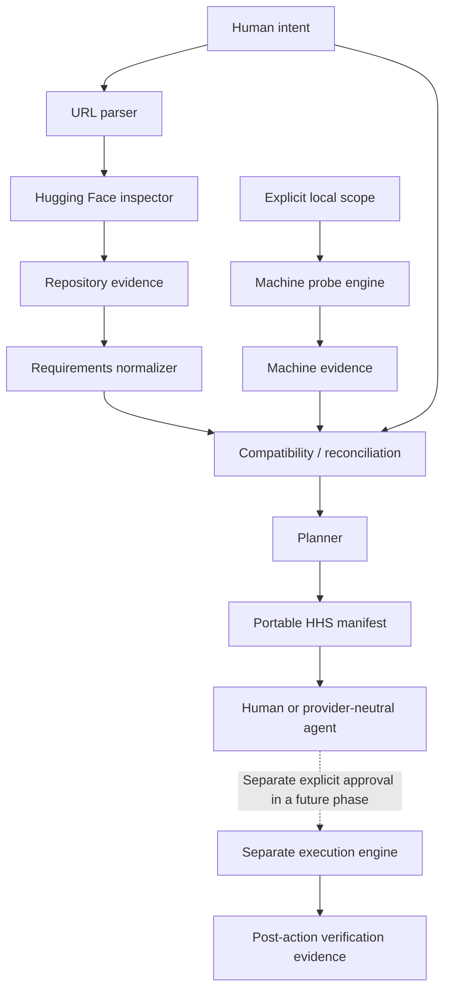

# Architecture

**Session 1 implements the bounded URL → model metadata → repository snapshot slice only. The broader pipeline below remains proposed.**

## Boundaries

| Area | Proposed responsibility | Must not do |
|---|---|---|
| Intent/URL parser | Identify goal, source, repository type and requested revision | Treat a vague install request or URL text as unlimited authority |
| Repository inspector | Bounded metadata and later allowlisted static file evidence | Download weights, follow arbitrary URLs, import code or run scripts |
| Probe engine | Scoped observations of trusted local providers | Repair missing components or enumerate secrets |
| Normalizer | Typed constraints, alternatives, conflicts and provenance | Drop uncertainty or silently prefer the newest claim |
| Reconciliation | Evaluate selected context against sourced requirements | Collapse all environments into one capability flag |
| Planner | Inert ordered actions, prerequisites, risks and verification intent | Execute commands or change evidence to match its desired plan |
| Manifest/exporters | Preserve canonical facts, IDs and redacted projections | Recompute verdicts differently per UI/agent |
| Future executor | Apply one explicitly approved bounded plan | Inherit authority from a manifest or discovery engine |

## Proposed data contracts

Use stable evidence, provider, requirement, finding and action IDs. Requirements point to their sources/revision; facts identify scope and time; findings reference both sides and a rule/version; actions name their target and prerequisites. The draft JSON Schema captures an initial transport shape, not a final domain architecture.

Preserve requested revision and resolved immutable revision separately. Record pagination coverage, file-size limits, unavailable metadata and API failures. Missing fields and empty arrays are not universal absence claims.

## Trust and flow

Repository content, README instructions, model code and agent responses are untrusted. Parsers work on data, not executable configuration. Reject unsafe URL schemes, credential-bearing URLs, unexpected hosts/redirects, path traversal and unbounded payloads in future implementation. Do not dereference arbitrary URLs found inside repository content.

Keep raw private observations local only if safe; public outputs should contain a minimized canonical projection with evidence scope. External AI export is opt-in and redacted. A secret filter is not a substitute for collecting less data.

## Implemented Session 1 slice

The Python standard-library modules are `hhs.hf.url_parser` (safe identity and revision grammar), `hhs.hf.client` (one bounded model-info API request), `hhs.hf.inspector` (allowlisted metadata, inert file classifications, evidence and V0 validation) and `hhs.cli` (JSON output). No Hugging Face SDK dependency, file downloader, machine engine or executor exists.

A single model-info document supplies repository and sibling file/LFS metadata under one resolved commit. File/page/byte coverage limits are explicit. Dataset/Space URLs are recognized but unsupported for inspection. README/configuration files have metadata only, with all content fetching absent. The V0 snapshot is separate from the unchanged Session 0 draft manifest.

See [Inspector V0](HF_REPOSITORY_INSPECTOR_V0.md) for endpoint, bounds, URL grammar, evidence semantics and transport limitations. Fixture tests pass; the one live attempt exposed an EOF bug that was fixed and regression-tested offline. Session 1.1 subsequently passed its single authorized live acceptance check without source changes. Phase 2 is not started.

Primary references reviewed: [Hugging Face Hub API](https://huggingface.co/docs/hub/api) and [HfApi metadata reference](https://huggingface.co/docs/huggingface_hub/package_reference/hf_api), 2026-09-14. These inform the transport contract; they do not establish compatibility or authorize remote-code execution.
