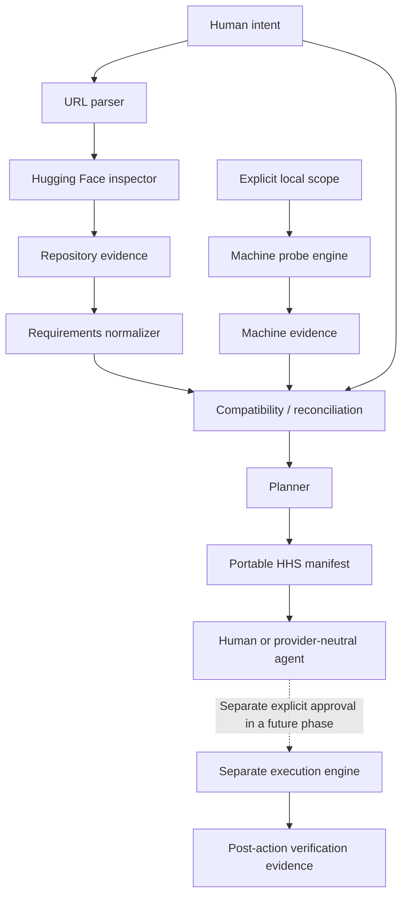

# Architecture

**Proposed modules and contracts. None of the pipeline is implemented.**

## Boundaries

| Area | Proposed responsibility | Must not do |
|---|---|---|
| Intent/URL parser | Identify goal, source, repository type and requested revision | Treat a vague install request or URL text as unlimited authority |
| Repository inspector | Bounded metadata and later allowlisted static file evidence | Download weights, follow arbitrary URLs, import code or run scripts |
| Probe engine | Scoped observations of trusted local providers | Repair missing components or enumerate secrets |
| Normalizer | Typed constraints, alternatives, conflicts and provenance | Drop uncertainty or silently prefer the newest claim |
| Reconciliation | Evaluate selected context against sourced requirements | Collapse all environments into one capability flag |
| Planner | Inert ordered actions, prerequisites, risks and verification intent | Execute commands or change evidence to match its desired plan |
| Manifest/exporters | Preserve canonical facts, IDs and redacted projections | Recompute verdicts differently per UI/agent |
| Future executor | Apply one explicitly approved bounded plan | Inherit authority from a manifest or discovery engine |

## Proposed data contracts

Use stable evidence, provider, requirement, finding and action IDs. Requirements point to their sources/revision; facts identify scope and time; findings reference both sides and a rule/version; actions name their target and prerequisites. The draft JSON Schema captures an initial transport shape, not a final domain architecture.

Preserve requested revision and resolved immutable revision separately. Record pagination coverage, file-size limits, unavailable metadata and API failures. Missing fields and empty arrays are not universal absence claims.

## Trust and flow

Repository content, README instructions, model code and agent responses are untrusted. Parsers work on data, not executable configuration. Reject unsafe URL schemes, credential-bearing URLs, unexpected hosts/redirects, path traversal and unbounded payloads in future implementation. Do not dereference arbitrary URLs found inside repository content.

Keep raw private observations local only if safe; public outputs should contain a minimized canonical projection with evidence scope. External AI export is opt-in and redacted. A secret filter is not a substitute for collecting less data.

## Session 1 boundary

Only repository metadata inspection is next. No machine probe engine or model download is needed for Inspector V0. Initial public model metadata support can coexist with explicit unsupported results for dataset/Space types. Define budgets and fixtures before coding; defer package installation and framework selection if existing tooling suffices.

Primary references reviewed on 2026-09-13: [Hugging Face Hub API](https://huggingface.co/docs/hub/api) and [Hub repositories](https://huggingface.co/docs/hub/repositories-getting-started). They establish a starting point for metadata/type/revision research, not a tested HHS implementation.
